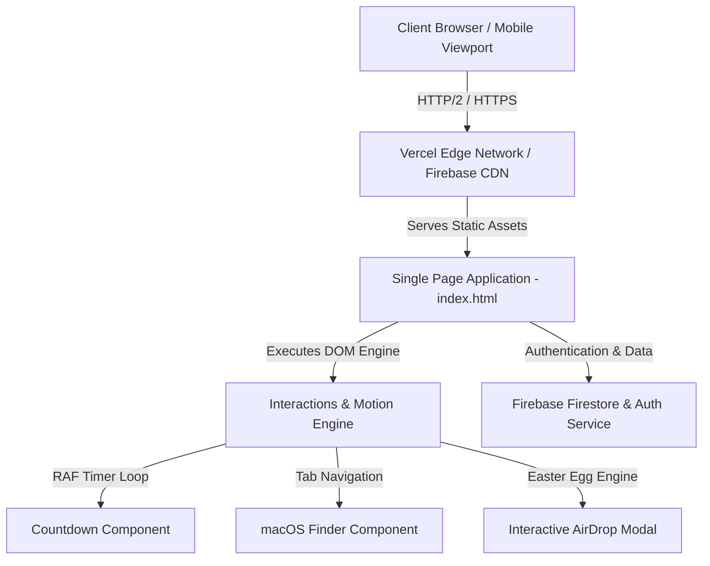

<div align="center">

  # 🕊️ DSB MUN 5.0
  ### Modern Conference Management Platform & Interactive Delegate Experience
  
  [](https://github.com/aradhyjain107/DSBMUN)
  [](https://github.com/aradhyjain107/DSBMUN/releases)
  [](LICENSE)
  [](#)
  [](#tech-stack)

  <p align="center">
    <strong>A high-performance, retro-futuristic web application built to streamline delegate registrations, committee allocation, schedule tracking, and Secretariat administration for Model United Nations conferences.</strong>
  </p>

  [🌐 Live Demo](#) • [✨ Features](#-key-features) • [🏗️ Architecture](#️-architecture) • [📖 Documentation](#-documentation-suite) • [🚀 Getting Started](#-getting-started)

  ---
</div>

## 📌 Executive Overview

**DSB MUN 5.0** is a full-stack, single-domain web application engineered for the 5th annual Model United Nations conference hosted by DSB International Public School (**1–2 August 2026**).

Designed with a custom **tactile design system** inspired by classic Mac OS X 10.0 window chrome, vintage paper zines, and tactile iOS primitives, the platform replaces outdated Google Forms and static spreadsheets with an engaging, interactive digital experience for delegates, faculty advisors, and conference leadership.

---

## 📖 The Story: Why This Was Built

> *"Every year, our school managed Model United Nations registrations using fragmented Google Forms and manual Excel spreadsheets—leading to registration bottlenecks, lost delegate preferences, and outdated schedule information."*

I built **DSB MUN 5.0** to eliminate administrative friction and provide delegates with a unified, state-of-the-art digital portal. Instead of scrolling through static PDFs, delegates can interactively explore committee agendas, view real-time countdowns, navigate the macOS-style Finder application for daily schedules and dress codes, and experience interactive Easter eggs.

---

## ✨ Key Features

| Feature | Description |
| :--- | :--- |
| 🏛️ **Committee Directory** | Asymmetric showcase of 9 specialized committees with custom SVG navy seals, background guide agendas, and misregistration cyan ghost hover effects. |
| 📁 **macOS Finder App** | Interactive desktop-style Finder interface featuring multi-tab views for Incharges, Committee Agendas, Schedule (Day 1 & Day 2), and Protocol Dress Code. |
| 🪟 **Mac OS X Window Chrome** | Retro brushed-metal window headers (`#FF5F57`, `#FEBC2E`, `#28C840` traffic lights) framing full-color leadership messages. |
| 🎁 **AirDrop Perks & Easter Eggs** | iOS-styled AirDrop UI card with interactive runaway decline button behavior, retro macOS system alerts, and tumbling escape animations. |
| ⏱️ **Zero-Stutter Countdown** | High-precision event countdown timer optimized with DOM caching and `requestAnimationFrame` to eliminate layout thrashing. |
| 📱 **Mobile & ARIA Accessibility** | Fluid responsive typography (`clamp()`), WebKit mobile flex/grid bounds, dual-ring `:focus-visible` states, and accessible keyboard arrow navigation (`role="tablist"`). |

---

## 📸 Visual Showcase & UI Highlights

```
+-----------------------------------------------------------------------------------+
|  [DSB] [MUN] [5.0]  DSB International Public School presents                      |
|  ===============================================================================  |
|  EVOLUTION FOR REVOLUTION                                                         |
|  02 Days : 14 Hours : 32 Mins : 10 Secs                                           |
+-----------------------------------------------------------------------------------+
|  [Mac OS X Window Chrome] --------------------------------------------- [ - ][ x ] |
|  Director General's Address · Plaksha                                             |
|  "Over the next few days, you'll argue, you'll laugh..."                          |
+-----------------------------------------------------------------------------------+
|  [Finder.app]                                                                     |
|  +----------------+ +-----------------------------------------------------------+ |
|  | [Incharges]    | | Day 1: Indian Traditional (1 Aug)                         | |
|  | [Committees]   | | Day 2: Western Formal    (2 Aug)                         | |
|  | [Schedule]     | |                                                           | |
|  | [Dress Code]   | | 8:30 AM Registration  ·  10:30 AM Session I                | |
|  +----------------+ +-----------------------------------------------------------+ |
+-----------------------------------------------------------------------------------+
```

---

## 🛠️ Tech Stack & Ecosystem

### Core Technologies
- **Frontend Core**: Vanilla HTML5, CSS3 Custom Properties (Design Tokens), ES6+ JavaScript.
- **Typography Stack**: `Bebas Neue` (Display Headlines), `Georgia` (Serif Accent), `Inter` (Body Copy).
- **Backend & Database**: Firebase Cloud Infrastructure (Firestore Database, Auth, App Hosting).
- **Deployment**: Vercel & Firebase Hosting with Global CDN Edge Caching.

### Shields & Metadata


---

## 🏗️ Architecture



---

## 📂 Repository Structure

```
MUN/
├── index.html            # Main SPA entry point (markup, embedded design system, scripts)
├── PRODUCT.md            # Product specification, feature requirements, user persona guide
├── DESIGN.md             # Visual DNA specification, design tokens, anti-slop rules
├── design.md             # Master 16-part architectural & aesthetic contract
├── CLAUDE.md             # Development protocol, terminology rules, and asset guidelines
├── CONTRIBUTING.md       # Open-source contribution guidelines & styling conventions
├── LICENSE               # MIT License
├── CHANGELOG.md          # Complete release version history (v1.0.0 -> v5.0.0)
├── .env.example          # Template environment variable configuration
├── favicon.png           # High-resolution website favicon
├── aradhy.png            # Head of Social Media & Web Lead portrait
├── ishika.png            # Executive Secretariat leadership portrait
├── plaksha.png           # Director-General leadership portrait
└── shiv.png              # Secretary-General leadership portrait
```

---

## 🚀 Getting Started

### Prerequisites
- Any modern web browser (Chrome, Firefox, Safari, Edge, Brave).
- A local HTTP server (e.g. VS Code Live Server, `npx serve`, or `python3 -m http.server`).

### Installation
```bash
# Clone the repository
git clone https://github.com/aradhyjain107/DSBMUN.git

# Navigate into the project directory
cd DSBMUN

# Start a local development server
python3 -m http.server 8000
```

Open `http://localhost:8000` in your web browser to view the application.

---

## 🛣️ Project Timeline & Version History

- **Version 1.0**: Initial single-page event landing page with basic committee listings.
- **Version 2.0**: Integrated delegate registration protocol and dress code specifications.
- **Version 3.0**: Implemented Mac OS X 10.0 window chrome and full-color leadership cards.
- **Version 4.0**: Built the interactive Finder application, AirDrop perks card, and runaway Easter Egg.
- **Version 5.0**: Complete Impeccable Design Framework audit, Bebas Neue & Inter typography upgrade, `requestAnimationFrame` countdown optimization, and keyboard ARIA accessibility.

---

## 🤝 Contributing

Contributions are welcome! Please read [CONTRIBUTING.md](CONTRIBUTING.md) before submitting pull requests or issue reports.

---

## 📄 License

Distributed under the MIT License. See [LICENSE](LICENSE) for more details.

---

<div align="center">
  <sub>Created & Engineered with ❤️ by <strong>Aradhy Jain</strong> (Website Creator & Head of Social Media) for DSB International Public School.</sub>
</div>
